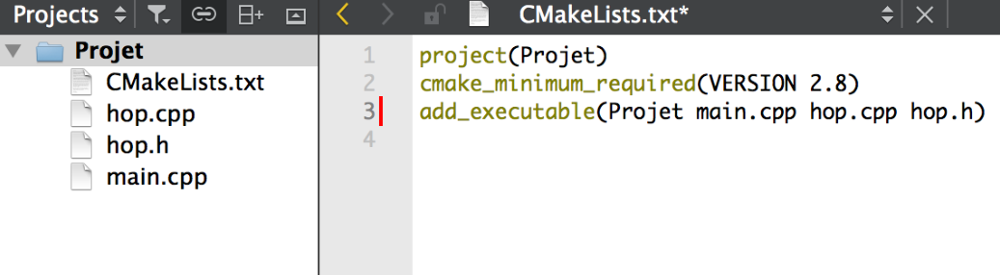
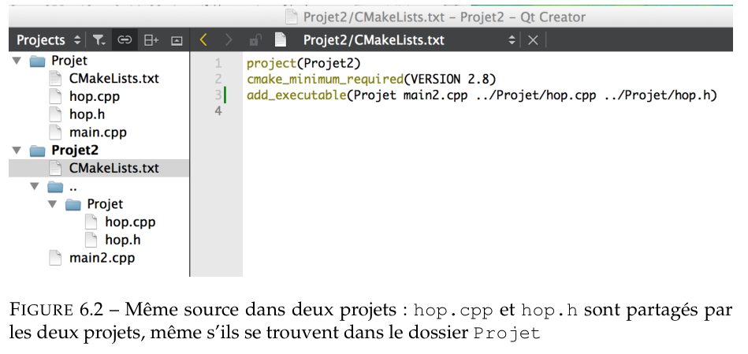

# Introduction au C++
## Cours n°5 <div style="font-size:50%;">(chap 6 du poly)</div>
<span class="myname"></span>
#### Slides par  Mathis Petrovich et Liza Belos


## Plusieurs fichiers sources



## Avantages
- Code plus lisible
- Accélère la compilation (compile uniquement les fichiers modifiés)
- Factorisation du code
- Gain de temps


## Plusieurs fichiers sources



## Note
### Pour un maximum de portabilité du code
Choisir **des noms de fichiers avec <a style="color: #2c40fb">seulement des caractères standard</a>** 

(pas de lettres accentuées ni d'espace)


## Principe
#### Dans QtCreator
- File/New File
- Choisir un modèle C++ Source File 
- Lui donner un nom, le mettre dans le dossier des sources
- Rajouter ce fichier dans le CMakeLists.txt
```cmake
add_executable(Hop main.cpp hop.cpp)
```


### Fichiers séparés
<div class="container">
<div class="col">

#### hop.cpp
```cpp
void f(int x) { ... }

int g() { ... }

int autre() {
    int a = g(); // Fonctionne
    f(a); // Fonctionne
}
```
</div>
<div class="col">

#### main.cpp
```cpp
int main() {
    // Ne fonctionne pas
    int a = g(); 
    // Ne fonctionne pas
    f(a);
}
```
</div>
</div>

Une fonction n'est pas "connue" en dehors de son fichier. <a style="color: #fb2c40"> Il faut la déclarer</a>!


### Fichiers séparés avec déclarations
<div class="container">
<div class="col">

#### hop.cpp
```cpp
void f(int x) { ... }

int g() { ... }

int autre() {
    int a = g(); // Fonctionne
    f(a); // Fonctionne
}
```
</div>
<div class="col">

#### main.cpp
```cpp
// Déclarations
void f(int x);
int g();

int main() {
    int a = g(); // Fonctionne
    f(a); // Fonctionne
}
```
</div>
</div>

Une fonction n'est pas "connue" en dehors de son fichier. <a style="color: #2c40fb"> Il faut la déclarer</a>!


# Les fichiers d'en-têtes


### Fichier d'en-têtes
<div class="container">
<div class="col">

#### hop.cpp
```cpp
void f(int x) { ... }

int g() { ... }
```
</div>
<div class="col">

#### hop.h
```cpp
// Déclarations
void f(int x);
int g();
```
</div>
</div>
<div class="container">
<div class="col">

#### main.cpp
```cpp
#include "hop.h"

int main() {
    int a = g();
    f(a);
}
```
</div>
<div class="col">

<a style="color: #2c40fb"> #include "nom"</a> est automatiquement remplacé par le contenu du fichier nom avant de procéder la compilation.
</div>
</div>


### Fichier d'en-têtes
#### hop.h
```cpp
// Types
struct Vecteur {
    double x, y;
};

// Déclarations
void f(int x);
int g();
```

### Mettre dans l'en-tête 
- les <a style="color: #2c40fb">déclarations</a> des fonctions 
- les <a style="color: #2c40fb">définitions</a> des nouveaux types


### Fichier d'en-têtes
<div class="container">
<div class="col">

#### vect.h
```cpp
// Types
struct vect{
	double x, y;
};

//Déclarations
double norme(vect V);
vect plus(vect A, vect B);
```
</div>
<div class="col">

#### vect.cpp
```cpp
// Fonctions et types
#include "vect.h"

// Définitions
double norme(vect V) {..}
vect plus(vect A, vect B) {..}
```
</div>
</div>

### Inclure l'en-tête
- Dans le fichier principal
- Dans le fichier séparé


## Erreurs à ne pas faire 
### <a style="color: #fb2c40">Ne jamais inclure de fichier cpp</a>
```cpp
// Ne pas faire
#include "vect.cpp"
// Ne pas faire
```

### Ne pas confondre la syntaxe
```cpp
// Ne fonctionne pas
#include <vect.h>

// Fonctionne
#include <iostream>
#include "vect.h"
```


### Phylosophie
- <span class="fragment">Le fichier séparé et son en-tête forment un tout cohérent :
  - implémente un certain nombre de fonctionnalités</span>
- <span class="fragment"> Le fichier d’en-tête doit être suffisamment clair et informatif :
  - l’utilisateur n’ait pas à regarder le fichier séparé lui-même </span>
  


## Conseil
Déclarer <a style="color: #2c40fb">seulement</a> les fonctions qui seront utilisées par le fichier principal


## Inclusions mutuelles
Il arrive que les fichiers d'en-tête aient besoin d'en inclure d'autres eux-mêmes...

###  <span class="fragment">  Comment faire pour <a style="color: #2c40fb">éviter</a> <a style="color: #fb2c40">les boucles infinies d'inclusions</a> ? </span>


## Inclusions mutuelles
## Méthode 1
```cpp
#pragma once
```
Mettre cette ligne au début de chaque fichier d’en-tête


## Inclusions mutuelles
## Méthode 2
```cpp
#ifndef VECT_H
#define VECT_H

//Déclarations
double norme(Vecteur V);
Vecteur plus(Vecteur A, Vecteur B);

#endif
```

Utiliser les instructions du pré-processeur


## Astuce
Astuce utile en cours de développement pour "cacher" un bout de code :
```cpp
#if 0
N'importe quoi ici sera ignoré par le compilateur.
#endif
```


## Chemin d'inclusion
#### Ou le compilateur va chercher les fichiers ?

- Pour les fichiers système, par example iostream, le chemin est connu.
- Dans le dossier courant, celui qui contient le cpp.
- Dans une liste de dossiers indiqués par l'utilisateur dans le CMakeLists.txt :
```cmake
include_directories(mon_dossier)
```


# Les opérateurs


## Les opérateurs
### Opération "plus" comme d'habitude
```cpp []
struct vect {
	double x, y;
};

vect plus(vect m, vect n) {
	vect p = {m.x + n.x, m.y + n.y};
	return p;
}

int main() {
	vect a = {1 2};
	vect c = plus(a, b);
	return 0;
}
```


## Les opérateurs
### Vraie opération "plus"
```cpp []
struct vect {
	double x, y;
};

vect operator+(vect m, vect n) {
	vect p = {m.x + n.x, m.y + n.y};
	return p;
}

int main() {
	vect a = {1 2};
	vect c = a + b;
	return 0;
}
```


## Différents opérateurs
<div class="container">
<div class="col">

#### <a style="color: #2c40fb">Calcul</a>
- operator+
- operator-
- operator*
- operator/
- operator=

</div>
<div class="col">

#### <a style="color: #2c40fb">Assignation</a>
- operator+=
- operator-=
- operator*=
- operator/=
</div>
</div>


## Différents opérateurs
<div class="container">
<div class="col">

#### <a style="color: #2c40fb">Comparaison</a>
- operator==
- operator<
- operator<=
- operator>
- operator>=
- operator!=

</div>
<div class="col">

#### <a style="color: #2c40fb">Logique</a>
- operator||
- operator&&
- operator!
#### <a style="color: #2c40fb">Incrémentation</a>
- operator++
- operator--
</div>
</div>


## Surcharge opérateur
```cpp [1-5|6-8|9-14]
// Produit par un scalaire
vect operator*(double s,vect m) { 
    vect p={s*m.x,s*m.y};
    return p;
}
double operator*(vect m,vect n) { // Produit scalaire
    return m.x*n.x+m.y*n.y;
}
int main() {
    vect a={1,2},b={3,4};
    vect c=2*a;
    double s=a*b;
    return 0;
}
```


## Fonctions récursives
```cpp [4-9|11-16]
#include <iostream>
using namespace std;

int factoriel(int N){
    if(N<=1)
        return 1;
    else
        return(N*factoriel(N-1));
}

int main()
{
    int N = 10;
    cout << N << "! = " << factoriel(N) << endl;
    return 0;
}
```

## Page du cours
http://imagine.enpc.fr/~monasse/Info/

### Fiche de référence du cours
Poly : <a style="color: #fb2c40">page 89</a>
