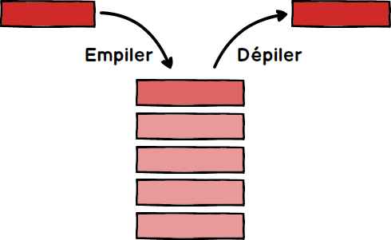
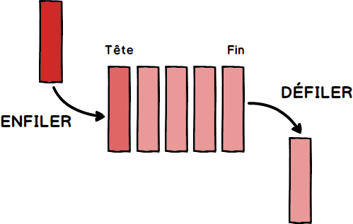

# Introduction au C++
## Cours n°6 <div style="font-size:50%;">(chap 7 du poly)</div>
### [name]
#### Slides par  Mathis Petrovich et Liza Belos


## Structure de données utiles
### Pile et File
<div class="container">
<div class="col">

#### Pile (Stack)


</div>
<div class="col">

#### File (queue)

</div>
</div>


## Structure de données utiles
### Pile et File
<div class="container">
<div class="col">

#### Pile (Stack)
<p>Celui qui est rangé en dernier dans la pile en est extrait en premier</p>
<p style="color: #de5d65">LIFO (Last in first out)</p>
</div>
<div class="col">

#### File (queue)
<p>Le premier arrivé est le premier sorti</p>
<p style="color: #de5d65">FIFO (First in first out)</p>
</div>
</div>


## Etude de ce programme (démo)
<div style="font-size: 70%; line-height: 600%;">

```cpp []
#include <iostream>
using namespace std;

void verifie(int p, int q, int quo, int res) {
    if (res<0 || res>=q || q*quo+res!=p)
        cout << "Tiens, c'est bizarre !" << endl;
}

int divise(int a, int b, int &r) {
    int q;
    q = a / b;
    r = a - q * b;
    verifie(a, b, q, r);
    return q;
}

int main() {
    int num, denom;
    do {
        cout << "Entrez deux entiers positifs : ";
        cin >> num >> denom;
    } while(num<=0 || denom<=0);
    int quotient, reste;
    quotient = divise(num, denom, reste);
    cout << num << "/" << denom << " = " << quotient <<
          " (Il reste " << reste << ")" << endl;
    return 0;
}
```
</div>


<!-- .slide: data-background="./images/sl6/01.png" data-background-size="contain" -->


<!-- .slide: data-background="./images/sl6/02.png" data-background-size="contain" -->
<h4 style="font-family: Consolas,monaco,monospace; background-color: black; color: white;" class="fragment">Entrez deux entiers positifs: <span class="fragment">23</span> <span class="fragment">3</span></h4>


<!-- .slide: data-background="./images/sl6/03.png" data-background-size="contain" -->


<!-- .slide: data-background="./images/sl6/04.png" data-background-size="contain" -->


<!-- .slide: data-background="./images/sl6/05.png" data-background-size="contain" -->


<!-- .slide: data-background="./images/sl6/06.png" data-background-size="contain" -->


<!-- .slide: data-background="./images/sl6/07.png" data-background-size="contain" -->


<!-- .slide: data-background="./images/sl6/08.png" data-background-size="contain" -->


<!-- .slide: data-background="./images/sl6/09.png" data-background-size="contain" -->


<!-- .slide: data-background="./images/sl6/10.png" data-background-size="contain" -->
<p style="background-color: black; color: white;" class="fragment">Un appel de fonction est un mécanisme qui permet de partir exécuter momentanément cette fonction puis de retrouver la suite des instructions et les variables qu'on avait provisoirement quittées.</p>


<!-- .slide: data-background="./images/sl6/11.png" data-background-size="contain" -->


<!-- .slide: data-background="./images/sl6/12.png" data-background-size="contain" -->


<!-- .slide: data-background="./images/sl6/13.png" data-background-size="contain" -->
<h4 style="font-family: Consolas,monaco,monospace; background-color: black; color: white;">23/3 = 7 (Il reste 2)</h4>


## Résumé de ce qu'on a observé
### Un appel de fonction 
- Mécanisme qui permet de <a style="color: #2c40fb">partir exécuter</a> momentanément cette fonction 
- Puis <a style="color: #2c40fb">retrouve</a> la suite des instructions et les variables


## Les variables locales
### Les paramètres
Les <a style="color: #2c40fb">paramètres</a> sont en fait des variables locales! 

#### Spécificité:
- <a style="color: #fb2c40">initialisation</a> dès le début de la fonction 
- avec les valeurs passées à l'appel de la fonction


## Les variables locales
### La pile
Les variables locales sont mémorisées dans <a style="color: #2c40fb">une pile</a> :

- <a style="color: #40fb2c">Création</a> d'une variable : on empile
- <a style="color: #fb2c40">Destruction</a> d'une variable : on dépile


## Les fonctions récursives
```cpp
int fact(int n) {
    if (n <= 1) 
		return 1;
    return n * fact1(n - 1);
}
```
### Pourquoi ça marche ?
- Les fonctions récursives ne sont pas différentes des autres. 
- C'est le système d'appel des fonctions en général qui rend la récursivité possible.


## Les fonctions récursives
### Efficacité
- La pile des appels n'est pas infinie et même relativement limitée
- Appeler une fonction est un mécanisme coûteux !
- Attention aux erreurs
```cpp
int errfact(int n) {
    if (n <= 1) return 1;
    return n * fact1(n + 1); // Erreur !!
}
```


### Version Dérécursivée (ou Iterative)
```cpp
int fact(int n) {
    if (n <= 1) 
		return 1;
    return n * fact1(n - 1);
}

int fact2(int n) {
    int f = 1;
    for (int i = 2; i <= n; i++) 
		f *= i;
    return f;
}
```


### Version Dérécursivée (ou Iterative)
```cpp
// Trés lent !!
int fib1(int n) {
    if (n <= 1) 
		return 1;
    return fib1(n - 2) + fib1(n - 1);
}

// Dérécursivée
int fib2(int n) {
    int fnm2 = 1, fnm1 = 1;
    for (int i = 2; i <= n; i++) {
        int fn = fnm2 + fnm1;
        fnm2 = fnm1;
        fnm1 = fn;
    }
    return fnm1;
}
```


## Le tas
### La pile est limitée en taille
```cpp []
int main() {
    const int n = 500000;
    int t[n]; // stack overflow !!
    ...
}
```


## Le tas
### Tableaux de taille variable
```cpp
int main() {
	int n = 500000;
    int* t = new int[n];
    ...
    delete[] t;
}
```

- Pour les tableaux de taille variable
- Pour les tableaux de grande taille


## Optimisation du compilateur
### mode Debug
- Possibilité de mettre des points de contrôle
- Plus simple pour bien mettre au point le programme
- Rester le plus longtemps possible ici


## Optimisation du compilateur
### mode Release
- Le compilateur optimise le code
- il transforme le code
- programme devient le plus performant possible


## Assertions
La fonction assert() prévient quand un test est faux, et précise le fichier et le numéro de ligne.
```cpp []
#include <cassert>

...
assert(n > 0);
int* t = new int[n];
...
delete[] t;
```

Elle ne ralentit pas les programmes car elle disparaît à la compilation en mode Release.


## Tableaux bidimensionnels
```cpp
const int m = 5, n = 3;

struct Tableau {
    double tab[m][n];
};

void f(Tableau &t) {
    for (int i = 0; i < m; i++) {
        for (int j = 0; j < n; j++) {
            t.tab[i][j] = cos(M_PI * i / m) * sin(M_PI * j / n);
        }
    }
    cout << t.tab[m - 1][n - 1] << endl;
}
```


## Examen sur machine
Nous vous conseillons de vous confronter aux examens proposés sur le site du cours !


## Page du cours
http://imagine.enpc.fr/~monasse/Info/

### Fiche de référence du cours
Poly : <a style="color: #fb2c40">page 105</a>
