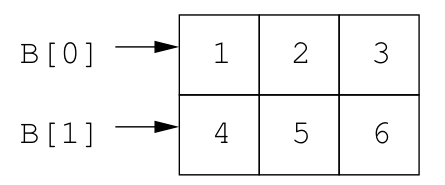
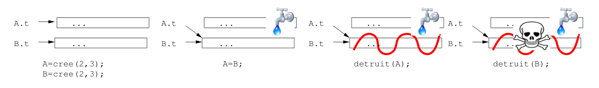

# Introduction au C++
## Cours n°7 <div style="font-size:50%;">(chap 8 du poly)</div>
### Mathis Petrovich


<!--  -->
## Tableaux bidimensionnels
### Principe
```cpp []
int A[2][3];
for (int i = 0; i < 2; i++) {
	for (int j = 0; j < 3; j++) {
		A[i][j] = i + j; // Attention: A[i,j] interdit!
	}
}
int B[2][3] = {{1,2,3},{4,5,6}}; // Init possible
const int M = 2, N = 3;  // Dimension constante
int C[M][N];
```
<!--  -->


## Tableaux bidimensionnels
### Schema



## Limitations (comme en 1D)
- Impossible de retourner un tableau 2D.
- Précision des dimensions obligatoires en paramètre


## Limitations
### Creation d'une fonction set
set: (x, y) => x+y

<table class="mytable">
<tr>
<td>0</td>
<td>1</td>
<td>2</td>
</tr>
<tr>
<td>1</td>
<td>2</td>
<td>3</td>
</tr>
</table>


## Rappel (comme en 1D)
### Passage toujours par référence
```cpp
void set(double A[2][3]) {
	for (int i = 0; i < 2; i++) {
		for (int j = 0; j < 3; j++) {
			A[i][j] = i + j;
		}
	}
}

...

double F[2][3];
set(F);
```


## Limitations
### Pour toute les tailles de matrices
```cpp
// Ne fonctionne pas ! double A[][] refusé
void set(double A[][], int m, int n) {
	for (int i = 0; i < m; i++) {
		for (int j = 0; j < n; j++) {
			A[i][j] = i + j;
		}
	}
}

...

double F[6][7];
set(F, 6, 7);
```


### <a style="color: #2c40fb">Solution</a> : Stocker le tableau 2D en 1D
### Dimensions: m,n => m*n
<div class="container">
<div class="col">

#### 1) Colonne par colonne
<table class="mytable">
<tr>
<td>B[0]</td>
<td>B[2]</td>
<td>B[4]</td>
</tr>
<tr>
<td>B[1]</td>
<td>B[3]</td>
<td>B[5]</td>
</tr>
</table>
B[i+j*m]
</div>
<div class="col">

#### 2) Ligne par ligne
<table class="mytable">
<tr>
<td>B[0]</td>
<td>B[1]</td>
<td>B[2]</td>
</tr>
<tr>
<td>B[3]</td>
<td>B[4]</td>
<td>B[5]</td>
</tr>
</table>
B[i*n+j]
</div>
</div>


## Exemple d'utilisation
```cpp
void set(double A[], int m, int n) {
	for (int i = 0; i < m; i++) {
		for (int j = 0; j < n; j++) {
			A[i+m*j] = i + j;
		}
	}
}

...

double F[6*7];
set(F, 6, 7);
```


## Exemple d'utilisation
```cpp
void produit(const double A[], int m, int n, 
             const double x[], double y[]) {
	for (int i = 0; i < m; i++) {
		y[i] = 0;
		for (int j = 0; j < n; j++) {
			y[i] += A[i+m*j] * x[j];
		}
	}
}

...
double A[2*3], x[3], y[2];
...
produit(A, 2, 3, x, y);
```


## Limitations
Pas d'allocation dynamiques de tableau 2D
```cpp
double ∗A = new double[6][7]; // NON !! Ne fonctione pas !!
```


## Stocker dans un tableau 1D!
```cpp
int m, n;
double ∗A = new double[m∗n];
double ∗x = new double[n];
double ∗y = new double[m];
...
// A = ...
// x = ...

produit(A, m, n, x, y); // y=Ax
delete[] A;
delete[] x;
delete[] y;
```


## Pourquoi ça marche?
### <a style="color: #fb2c40">``int``</a> <a style="color: #2c40fb">``t[n]``</a>
- Définit une variable locale, 
- => donc de la mémoire dans la pile
- capable de stocker n variables int


## Pourquoi ça marche?
### <a style="color: #fb2c40">``int``</a> *<a style="color: #2c40fb">``t``</a>
- Définit une variable de type <a style="color: #40fb2c">pointeur</a> d'int
- t peut mémoriser l’adresse d’une zone mémoire contenant des int


## Pourquoi ça marche?
### <a style="color: #fb2c40">``new int``</a><a style="color: #2c40fb">``[n]``</a>
- Alloue dans le tas une zone mémoire pouvant stocker n int 
- et renvoie l’adresse de cette zone. 

D'où le :
```cpp 
int *t = new int[n];
```


## Pourquoi ça marche?
### <a style="color: #fb2c40">``delete[]``</a> <a style="color: #2c40fb">``t``</a>
- delete[] t libère dans le tas la mémoire 
- correspondant à l’adresse mémorisée dans t


## Pourquoi ça marche?
### <a style="color: #fb2c40">``delete[]``</a> <a style="color: #2c40fb">``t``</a>
- Si t est de taille fixe t[i]
  - ieme element du tableau
- Si t est un pointeur d'int t[i] 
  - i place plus loin en mémoire que l'adresse t

=> Dans tout les cas, c'est bon !


## Pourquoi ça marche?
### Taille fixe
- La syntaxe "t" tout court 
  - Adresse (dans la pile) à laquelle le tableau est mémorisé. 
- Marche exactement comme les pointeurs 

```cpp
void f(int t[]); // Syntaxe "tableau"
void g(int *t);  // Syntaxe "pointeur"
```
Les deux formes marchent.


## Exemple
```cpp
double somme(double *t, int n) { // syntaxe "pointeur"
	double s=0;
	for (int i=0; i<n; i++)
		s+=t[i];
	return s;
}

int t1[4];
...
double s1 = somme(t1, 4);
...
int *t2 = new int[n];
...
double s2 = somme(t2, n);
...
delete[] t2;
```


## Erreurs classiques
### Oublier d'allouer
```cpp
int *t;
for (int i=0;i<n;i++)
   t[i]=...  // Horreur: t vaut n'importe
             // quoi comme adresse
```


## Erreurs classiques
### Oublier de désallouer:
```cpp
void f(int n) {
    int *t=new int[n];
    ...
 } // On oublie delete[] t;
   // Chaque appel à f() va perdre n int dans le tas!
```


## Erreurs classiques
### Ne pas désallouer ce qu'il faut:
```cpp
int* t=new int[n];
int* s=new int[n];
...
s=t; 
// Aie! Du coup, s contient la même adresse que t
// (On n'a pas recopié la zone pointée par t dans celle
//  pointée par s!)
...
delete[] t; // OK
delete[] s; 
// Cata: Non seulement on ne libère pas la mémoire
// initialement mémorisée dans s, mais en plus on 
// désalloue à nouveau celle qui vient d'être libérée!
```


## Quand libérer
### Le plus tôt possible!
```cpp
void f() {
    int t[10];
    int* s=new int[n];
    ...
    delete[] s; // si s ne sert plus dans la suite...
                // Autant libérer maintenant...
    ...
} // Par contre, t attend cette ligne pour mourir. 
// La variable s (qui mémorise l'adresse) meurt aussi ici
```


## Pointeurs et fonctions
```cpp
int* alloue(int n) {
     return new int[n];
}
   ....
   int* t=alloue(10);
   ...
   // Ne pas oublier de libérer la mémoire!
   delete[] t;
```


## Pointeurs et fonctions
### Passage par valeur!
```cpp
void f(int* t, int n) {
     ....
     t[i]=...; // On modifie t[i] mais pas t!
     t=... // Une telle ligne ne changerait pas 's' 
           // dans la fonction appelante
		   // car t est une variable locale ici
}
...
    int* s=new int[m];
    f(s,m);
```


## Pointeurs et fonctions
### Cas des tableaux 
Passage de l'adresse du tableau <a style="color: #fb2c40">par valeur!</a>

Abus de langage de dire qu'il passe par référence..


## Pointeurs et fonctions
### Comment passer par référence
```cpp
// t et n seront modifiés (et plus seulement t[i])
void alloue(int*& t,int& n) {
   cin >> n; // n est choisi au clavier
   t=new int[n];
}
    ...
    int* t;
    int n;
    alloue(t,n); // t et n sont affectés par alloue()
    ...
    delete[] t; // Ne pas oublier pour autant!
```


## Syntaxe création pointeurs
### Une étoile par pointeur
```cpp
int *t, *s, *u; // pour plusieurs pointeurs
int *a, b; // a est un pointeur b non
int* a, b; // même chose
```

### Exemple 
<div class="container">
<div class="col">

```cpp
int *a = new int[10];
a[1] = 6;
delete[] a;
```

</div>
<div class="col">

```cpp
int *a = new int;
*a = 6;
delete a;
```

</div>
</div>


## Exemple plus approfondi
```cpp
int a = 10;
int *pa = &a; // Stocke l'adresse de a dans pa
*pa = 20;
cout << a << endl; // 20
```

```cpp
int a[10];
int *pa = a; // Stocke l'adresse de a dans pa
pa[2] = 6;
cout << a[2] << endl; // 6
```


## Structures/ allocation dynamique
### Implémentation <a style="color: #2c40fb">des matrices</a>
Plus besoin de passer systématiquement le tableau et ses dimensions.


<div style="font-size: 70%; line-height: 600%;">

```cpp [9-12|14-20|22-24|26-28,30-32|34-49|51-59|63-88]
#include <iostream>
#include <string>
using namespace std;

//==================================================
// fonctions sur les matrices
// pourraient etre dans un matrice.h et un matrice.cpp

struct Matrice {
    int m,n;
    double* t;
};

Matrice cree(int m,int n) {
    Matrice M;
    M.m=m;
    M.n=n;
    M.t=new double[m*n];
    return M;
}

void detruit(Matrice M) {
    delete[] M.t;
}

double get(Matrice M,int i,int j) {
	return M.t[i+M.m*j];
}

void set(Matrice M,int i,int j,double x) {
	M.t[i+M.m*j]=x;
}

Matrice produit(Matrice A,Matrice B) {
    if (A.n!=B.m) {
        cout << "Erreur!" << endl;
        exit(1);
    }
    Matrice C=cree(A.m,B.n);
    for (int i=0;i<A.m;i++)
        for (int j=0;j<B.n;j++) {
            // Cij=sum Aik*Bkj
			set(C,i,j,0);
            for (int k=0;k<A.n;k++)
				set(C,i,j,get(C,i,j)+get(A,i,k)*get(B,k,j));
            
        }
    return C;
}

void affiche(string s,Matrice M) {
    cout << s << " =" << endl;
    for (int i=0;i<M.m;i++) {
        for (int j=0;j<M.n;j++)
			cout << get(M,i,j) << " ";
        cout << endl;
    }
}

//==================================================
// Utilisateur 

int main()
{
	// Init A
    Matrice A=cree(2,3);
    for (int i=0;i<2;i++)
        for (int j=0;j<3;j++)
			set(A,i,j,i+j);
    affiche("A",A);
	
	// Init B
    Matrice B=cree(3,5);
    for (int i=0;i<3;i++)
        for (int j=0;j<5;j++)
			set(B,i,j,i*j);
    affiche("B",B);
	
	// Calcule le produit
    Matrice C=produit(A,B);
    affiche("C",C);
	
	// libère la mémoire
    detruit(C);
    detruit(B);
    detruit(A);
    return 0;
}
```
</div>


### Attention au double delete!



## Instruction supplémentaire
Boucles et continue 
```cpp []
for (...) {
	...
	if (A)
		continue; // repasse ligne 1
	...
	if (B)
		break; // passe ligne 9 
	...
}
```


## Utilisation : + de clarté
### Evacue les cas particuliers
<div class="container">
<div class="col">

#### Avant
```cpp
for (...) {
    ...
    if (!A) {
        ...
        if (!B) {
              ...
    	  }
    }
 }
```
</div>
<div class="col">

#### Après
```cpp
for (...) {
    ...
    if (A)
		continue;
    ...
	if (B)
		continue;
}
```
</div>
</div>


## Page du cours
http://imagine.enpc.fr/~monasse/Info/

### Fiche de référence du cours
Poly : <a style="color: #fb2c40">page 117</a>
