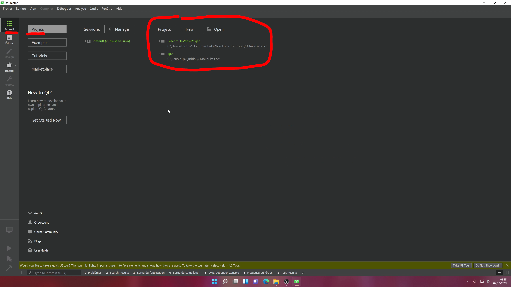
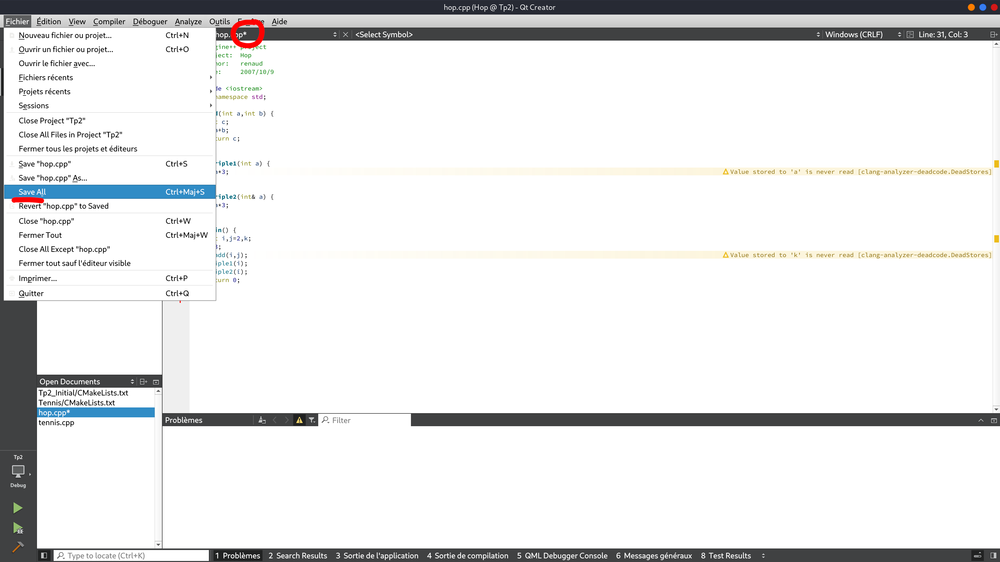
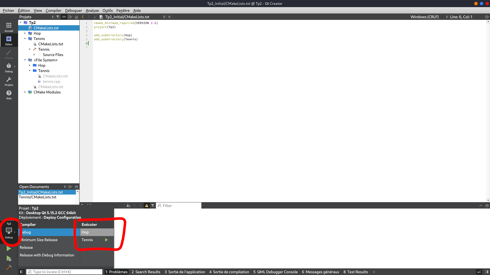

# Qt Creator
#### Thomas Belos


## Introduction
### CMake
CMake est un outil et un langage permettant la gestion des projets C++. Il simplifie la création de vos projets, et vous permets d'exporter votre projet en librairie, et d'en importer d'autres.


Un projet à plusieurs caractéristiques :
- Il peut contenir plusieurs executables, par exemple Hop et Tennis
- Il peut contenir plusieurs fichiers sources


Voici un exemple de CMakeLists.txt :
```cmake
cmake_minimum_required(VERSION 3.20)
project(exemple)

add_executable(exemple main.cpp)
```


### Les librairies
En C++, tout comme en Python, d'autres personnes vont créer du code, que vous pourrez réutiliser dans vos projets.
Ces codes sont appelés des librairies.


- Vous devez connaitre Numpy qui est une librairie mathématique en Python
- Imagine++ est une librairie développée par M. Monasse permettant la création et le dessin sur des fenêtres


### Les IDE
Un **IDE** (integrated development environment) est un logiciel contenant un ensemble de fonctions simplifiant le développement.


- Un éditeur de texte avec coloration
- Un outil de gestion de projets
- Une interface pour compiler, exécuter et debugger facilement et rapidement le code.


Qt Creator est un IDE pour le C++. Il en existe beaucoup d'autres, notamment les deux plus populaire sont CLion et VSCode.


## Les projets


### Ouvrir un projet


<video src="images/qtcreator/open_a_project.mp4" autoplay loop controls></video>


### Créer un projet


Étape 1 / 3
<video src="images/qtcreator/new_file_or_project.mp4" autoplay loop controls></video>


Étape 2 / 3
<video src="images/qtcreator/choose_qt_project.mp4" autoplay loop controls></video>


Étape 3 / 3
<video src="images/qtcreator/project_creation.mp4" autoplay loop controls></video>


### Re-ouvrir un projet





### Sauvegarder un projet



L'étoile indique que vous n'avez pas sauvegardé votre fichier.


Utilisez CTRL + S pour sauvegarder rapidement un fichier.


### Ajouter des sources à mon projet


Étape 1 / 5
<video src="images/qtcreator/fs_mode.mp4" autoplay loop controls></video>


Étape 2 / 5
<video src="images/qtcreator/new_file_or_project_2.mp4" autoplay loop controls></video>


Étape 3 / 5
<video src="images/qtcreator/new_cpp.mp4" autoplay loop controls></video>


Étape 4 / 5
<video src="images/qtcreator/name_a_file.mp4" autoplay loop controls></video>


Étape 5 / 5
<video src="images/qtcreator/add_file_to_cmake.mp4" autoplay loop controls></video>
```cmake
add_executable(VotreExecutable fichier1.cpp fichier2.cpp)
```


Pensez à sauvegarder votre CMakeLists.txt pour que vos modifications soit pris en compte par Qt.


### Plusieurs exécutables dans un seul projet
```cmake
add_executable(VotreExecutable1 fichier1.cpp fichier2.cpp fichier3.cpp)
add_executable(VotreExecutable2 fichier4.cpp fichier5.cpp fichier6.cpp)
```


###  Switcher entre les exécutables





### Utiliser des librairies pour mon projet
```cmake
find_package(Imagine REQUIRED)

project(VotreProjet)
add_executable(VotreExecutable fichier.cpp)
ImagineUseModules(VotreExecutable Graphics)
```
Attention aux majuscules !!! Le nom doit être EXACTEMENT le même dans add_executable et ImagineUseModules.

```cpp
#include <Imagine/Graphics.h>

using namespace Imagine; // Attention à bien placer cette ligne après les #include
```


### Fin
